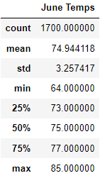

# surfs_up

## Overview of analysis

The purpose of this challenge was to query SQLite to aggregate and recieve statistics on weather data to determine whether a surf and ice cream shop would be a sustainable business year round. 

### Purpose

First an engine was set up for SQLite and a session was created. Then the extract function was imported from sqlalchemy and was used to filter only the temperature results for the month of June. This was then placed into a list and
converted into a dataframe. Then the describe function was used to generate summary statistics. This process was then repeated for december data.
	
## Results

There were a few differences between the June and December summary statistics: 

* The standard deviation is roughly 15% higher in the December than in June. This implies that the impact of weather on ice cream sales is far more volitile in the winter.    

* The IQR is 25% larger in December than in June showing that the standard deviation also implying further weather volatility.

* The mean value is almost 75°F in June and roughly 71°F in December. This is a significant difference, but not as large of a difference as one would expect from one of the hottest months of the year and one of the coldest months of the year. 

### Summary Statistics

The following is the summary statistics for the month of June:

The following is the summary statistics for the month of December:

## Summary

The data we queried only provided data on temperature for two months that were likely to be the most extreme. Additional queries could be performed to provide additional context and more useful information. 
 
### Analysis

After analyzing the data the results are quite different than I initially expected. June weather does not seem to be as favorable for ice cream/surf shop sales as expected. The mean temperature for June is almost 75°F which does not 
preclude ice cream consumption but it hardly encourages it either. December weather does seems to be far more favorable than expected for ice cream/surf shop sales. The mean temperature for December is roughly 71°F which 
does not discourage ice cream consumption as much as expected. The variability during both months is fairly low. This would mean that the impact solely based on the weather the sales would not be particularly volitile. If we wanted to 
know more about the potential effects of the weather on sales of the surf/ice cream shop I would run two queries to count how many days of the year are above 85°F and how many days are below 70°F. This would likely be a quick way of 
determining how many days would be favorable to sales and how many days would be highly unfavorable. I would also write a query to determine how many days of the year any precipitation occurs. This could then be used to determine the 
number of unfavorable business days by combining the list of rainy days with the list of cold days and removing any overlap. 
